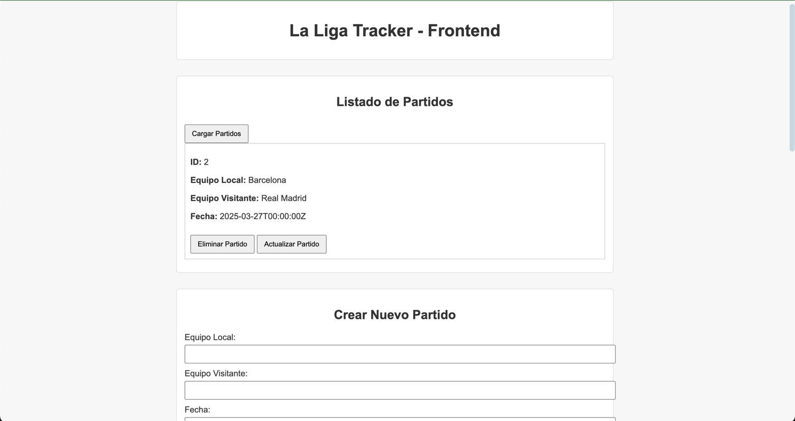
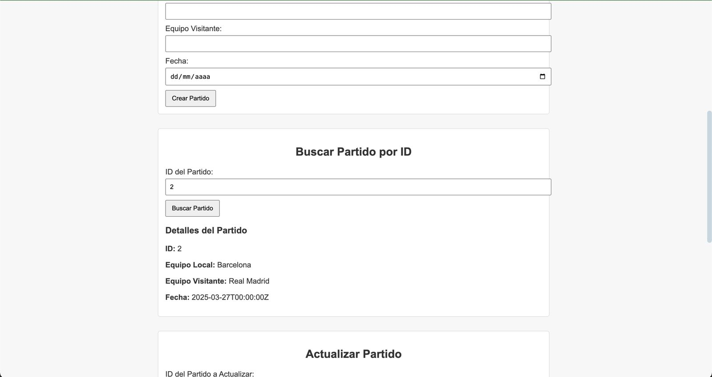
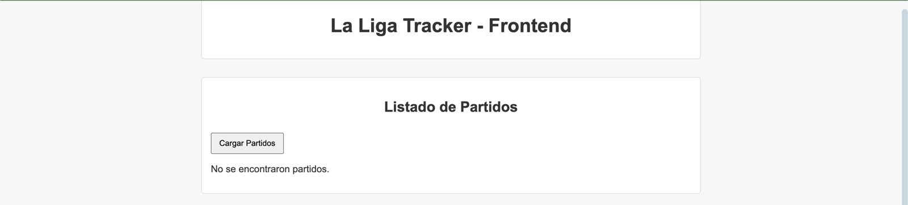

# 🏆 Match Tracker

🚀 **Match Tracker** es una API construida con **Go** y **PostgreSQL** que permite gestionar partidos de fútbol, incluyendo la creación, actualización, eliminación y consulta de encuentros.





---

## 📌 Características

✅ **CRUD de Partidos**: Crea, lee, actualiza y elimina partidos.  
✅ **Base de Datos**: Utiliza PostgreSQL para almacenamiento eficiente.   
✅ **CORS habilitado**: Permite solicitudes desde cualquier origen.  

---

## 🛠️ Tecnologías

- **Backend**: Go + Gin  
- **Base de Datos**: PostgreSQL  
- **ORM**: GORM  
- **Servidor**: Gin + CORS  

---

## 🚀 Instalación y Uso

### 1️⃣ Clonar el repositorio
```bash
git clone https://github.com/jruiz002/API_Partidos.git
